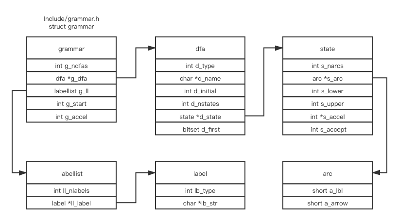
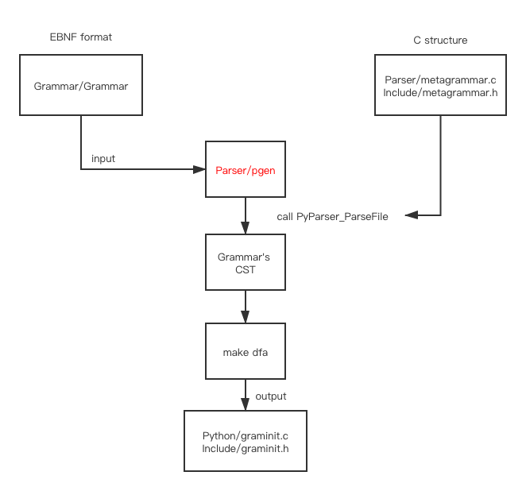

# compile

# contents

* [related file](#related-file)
* [tokenizer](#tokenizer)

The following contents are based on version 3.10.0 alpha 0

```bash
git reset --hard 38d3864efe914fda64553e2ec75c9ec15574483f
```

# related file

* Python/pythonrun.c
* Parser/tokenizer.c
* Parser/tokenizer.h
* Parser/parsetok.c
* Include/grammar.h
* Parser/metagrammar.c
* Include/metagrammar.h

# pgen

This is the layout of "grammar" structure




```bash
make regen-grammar
gcc -g -O0 -Wall  -L/usr/local/opt/llvm/lib   Parser/acceler.o Parser/grammar1.o Parser/listnode.o Parser/node.o Parser/parser.o Parser/bitset.o Parser/metagrammar.o Parser/firstsets.o Parser/grammar.o Parser/token.o Parser/pgen.o Objects/obmalloc.o Python/dynamic_annotations.o Python/mysnprintf.o Python/pyctype.o Parser/tokenizer_pgen.o Parser/printgrammar.o Parser/parsetok_pgen.o Parser/pgenmain.o -ldl   -framework CoreFoundation -o Parser/pgen
# Regenerate Include/graminit.h and Python/graminit.c
# from Grammar/Grammar using pgen
Parser/pgen ./Grammar/Grammar \
                ./Include/graminit.h.new \
                ./Python/graminit.c.new
Translating labels ...
python3 ./Tools/scripts/update_file.py ./Include/graminit.h ./Include/graminit.h.new
python3 ./Tools/scripts/update_file.py ./Python/graminit.c ./Python/graminit.c.new
```

There's a program inside the `Parser/` directory, the above compile and run command will compile the `Parser/pgenmain.o` and output a program named `Parser/pgen`, which takes a **grammar file** as input and generate `grammar` structure, `dfa` tables and etc...(above diagram)  as outpout(two c files, `graminit.c` and `graminit.h`)


Let's focus on `pgen` 

The built-in `Parser/metagrammar.c` and `Include/metagrammar.h` will be used as the input grammar file's grammar




# tokenizer

Let's begin with the python Interactive loop, and execute a simple line

```pythoon3
./python.exe
>>> a1 = 10 + 2
```

Token parser will scan the input and prase your input string according to the function written in `Parser/tokenizer.c->tok_get`


# read more

* [what-is-the-difference-between-an-abstract-syntax-tree-and-a-concrete-syntax-tree](https://stackoverflow.com/questions/1888854/what-is-the-difference-between-an-abstract-syntax-tree-and-a-concrete-syntax-tre)

* [What's the Difference Between BNF, EBNF, ABNF?](http://xahlee.info/parser/bnf_ebnf_abnf.html#:~:text=BNF syntax can only represent,excluding alternatives%2C comments%2C etc.)

