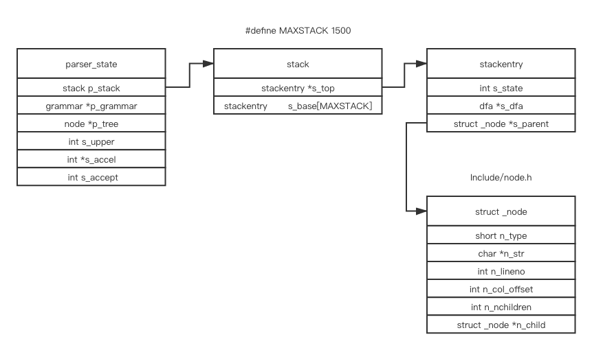
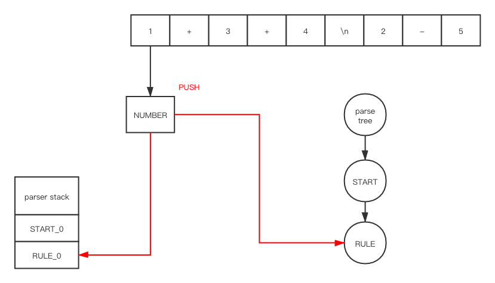
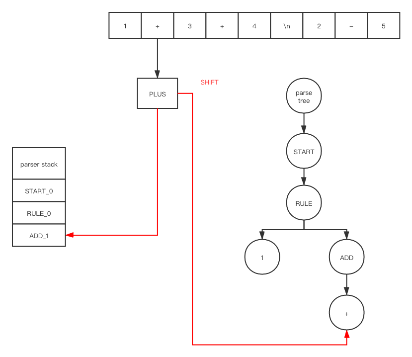
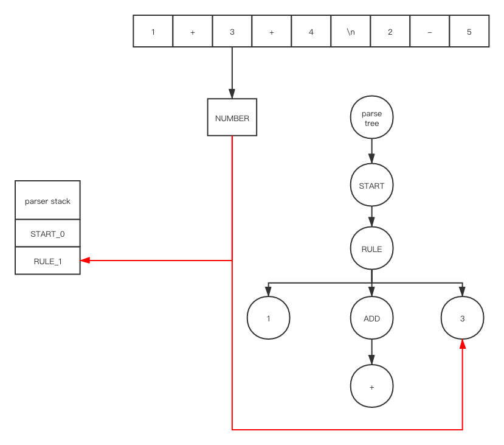
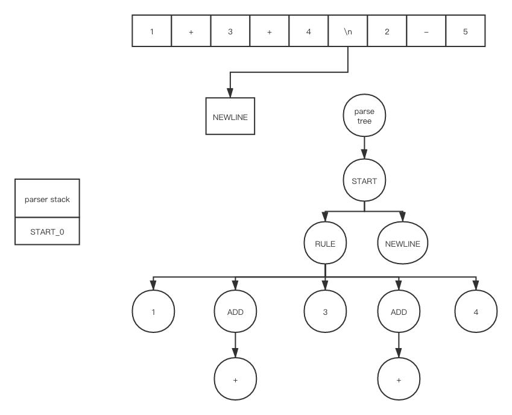

# compile

# contents

* [related file](#related-file)
* [pgen](#pgen)
  * [the dfa of `ExampleGrammar`](#the-dfa-of-ExampleGrammar)
  * [parse](#parse)
  * [make dfa](#make-dfa)

* [read more](#read-more)

# related file

* Python/pythonrun.c
* Parser/tokenizer.c
* Parser/tokenizer.h
* Parser/parsetok.c
* Include/grammar.h
* Parser/metagrammar.c
* Include/metagrammar.h
* Parser/pgen.c

# pgen

This is the layout of "grammar" structure


```bash
make regen-grammar
gcc -g -O0 -Wall  -L/usr/local/opt/llvm/lib   Parser/acceler.o Parser/grammar1.o Parser/listnode.o Parser/node.o Parser/parser.o Parser/bitset.o Parser/metagrammar.o Parser/firstsets.o Parser/grammar.o Parser/token.o Parser/pgen.o Objects/obmalloc.o Python/dynamic_annotations.o Python/mysnprintf.o Python/pyctype.o Parser/tokenizer_pgen.o Parser/printgrammar.o Parser/parsetok_pgen.o Parser/pgenmain.o -ldl   -framework CoreFoundation -o Parser/pgen
# Regenerate Include/graminit.h and Python/graminit.c
# from Grammar/Grammar using pgen
Parser/pgen ./Grammar/Grammar \
                ./Include/graminit.h.new \
                ./Python/graminit.c.new
Translating labels ...
python3 ./Tools/scripts/update_file.py ./Include/graminit.h ./Include/graminit.h.new
python3 ./Tools/scripts/update_file.py ./Python/graminit.c ./Python/graminit.c.new
```

There's a program inside the `Parser/` directory, the above command will compile and run the `Parser/pgenmain.o` and output a program named `Parser/pgen`, which takes a **grammar file** as input and generate `grammar` structure, `dfa` tables and etc...(above diagram)  as outpout(two c files, `graminit.c` and `graminit.h`)


Let's focus on `pgen` 

The built-in `Parser/metagrammar.c` and `Include/metagrammar.h` will be used as the input grammar file's grammar

`metagrammar` is used for parsing the `EBNF`  format's grammar file

`graminit` is used for parsing `Python` 's source code

They both generated in the same way, with different `Grammar` file


The `Parser/metagrammar.c` and `Include/metagrammar.h` 's grammar 

>```bash
>MSTART: (NEWLINE | RULE)* ENDMARKER
>RULE: NAME ':' RHS NEWLINE
>RHS: ALT ('|' ALT)*
>ALT: ITEM+
>ITEM: '[' RHS ']' | ATOM ['*' | '+']
>ATOM: NAME | STRING | '(' RHS ')'
>```

It's like a compiler which can compile itself, For more detail please refer to [python compiler from grammar to dfa](https://aoik.me/blog/posts/python-compiler-from-grammar-to-dfa)

Let's focus on how `pgen` work with a simple example

```bash
% cat Grammar/ExampleGrammar 
START: (NEWLINE | RULE)* ENDMARKER
RULE: NUMBER (ADD NUMBER)*
ADD: '+' | '-'
```

We can use the default `pgen` to generate code for our `ExampleGrammar`

```bash
make regen-grammar
Parser/pgen ./Grammar/ExampleGrammar \
                ./Include/examplegrammar.h \
                ./Parser/examplegrammar.c
```

With a little manual edition to make the following compile command work, the final [examplegrammar.c](https://github.com/zpoint/CPython-Internals/tree/master/Interpreter/compile/gen/examplegrammar.c) 

And compile the edited generated grammar code and compile a new `pgen2` program [example_grammar.sh](https://github.com/zpoint/CPython-Internals/tree/master/Interpreter/compile/gen/example_grammar.sh)

```bash
sh example_grammar.sh
```

After get `Parser/pgen2`, we can verify that if our grammar works correctly

```bash
% cat my_file.txt 
1 + 3 + 4
2 - 5
# run the following command will fail, our purpose is to see the dfa state
# if you comment `Parser/parser.c`'s marco and set the `Parser/parser.c`'s marco to '#define D(x) x' and rerun the above compile command
# you can see the output of DFA state is in the ACCEPT state
# it means our grammar works correctly
Parser/pgen2 ./my_file.txt \
                ./Include/my_file.h \
                ./Parser/my_file.c
```

## the dfa of `ExampleGrammar`


This is the dfa due to [examplegrammar.c](https://github.com/zpoint/CPython-Internals/tree/master/Interpreter/compile/gen/examplegrammar.c) or [ExampleGrammar](https://github.com/zpoint/CPython-Internals/tree/master/Interpreter/compile/gen/ExampleGrammar)

## parse

The first step is to parse the Grammar file according to the [BuiltInGrammar](https://github.com/zpoint/CPython-Internals/tree/master/Interpreter/compile/gen/BuiltInGrammar) and build a CST tree

The call stack of `Parser/pgenmain.c`


`parsetok` will call `PyTokenizer_Get->tok_get` to get tokens, for each token, `PyParser_AddToken` will be called

`tokens` are predefined in `Parser/token.c` and `Include/token.h`, which is also auto generated from `Grammar/Tokens` by command `make regen-token`

This is the helper structure when parsing



There're too much detail, I am not going to show every element's value is every structure, Let's go through our `ExampleGrammar`  with `my_file.txt` token by token

After `push`



After `shift`


After `push`


After `shift`



Because `ADD_1` is the accept state, `POP` will be called, after `POP`


After `push` and `shift`




And so on ...




##  make dfa

The function defined in `Parser/pgen.c` will take the above tree as input, and a `grammar` structure as output

```c
grammar *
pgen(node *n)
{
    nfagrammar *gr;
    grammar *g;

    gr = metacompile(n);
    g = maketables(gr);
    translatelabels(g);
    addfirstsets(g);
    freenfagrammar(gr);
    return g;
}
```

The comment in `Parser/pgen.c`

> ```c
> /*
> Input is a grammar in extended BNF (using * for repetition, + for
> at-least-once repetition, [] for optional parts, | for alternatives and
> () for grouping).  This has already been parsed and turned into a parse
> tree.
> 
> Each rule is considered as a regular expression in its own right.
> It is turned into a Non-deterministic Finite Automaton (NFA), which
> is then turned into a Deterministic Finite Automaton (DFA), which is then
> optimized to reduce the number of states.  See [Aho&Ullman 77] chapter 3,
> or similar compiler books (this technique is more often used for lexical
> analyzers).
> 
> The DFA's are used by the parser as parsing tables in a special way
> that's probably unique.  Before they are usable, the FIRST sets of all
> non-terminals are computed.
> */
> ```


# read more

* [what-is-the-difference-between-an-abstract-syntax-tree-and-a-concrete-syntax-tree](https://stackoverflow.com/questions/1888854/what-is-the-difference-between-an-abstract-syntax-tree-and-a-concrete-syntax-tre)
* [What's the Difference Between BNF, EBNF, ABNF?](http://xahlee.info/parser/bnf_ebnf_abnf.html)
* [A Meta-Grammar for PEG Parsers](https://medium.com/@gvanrossum_83706/a-meta-grammar-for-peg-parsers-3d3d502ea332)
* [Python's compiler - from grammar to dfa](https://aoik.me/blog/posts/python-compiler-from-grammar-to-dfa)
* [the-origins-of-pgen](http://python-history.blogspot.com/2018/05/the-origins-of-pgen.html)

