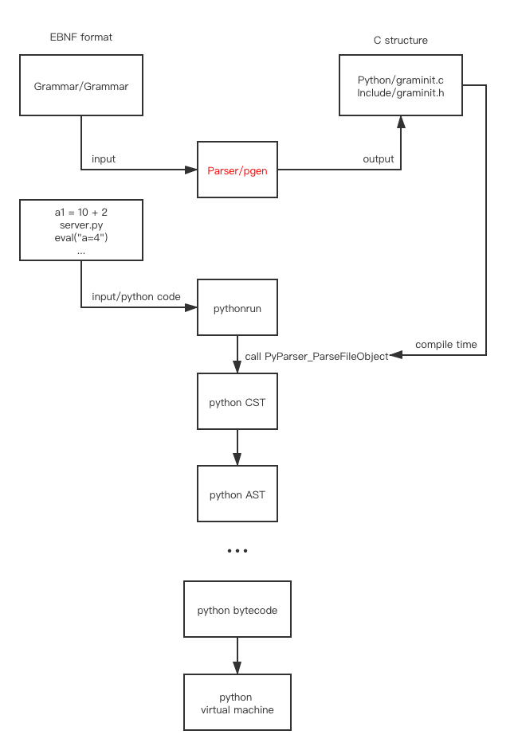

# compile

# contents

* [related file](#related-file)
* [tokenizer](#tokenizer)

# related file

* Python/pythonrun.c
* Parser/tokenizer.c
* Parser/tokenizer.h
* Parser/parsetok.c
* Include/grammar.h
* Parser/metagrammar.c
* Include/metagrammar.h

# pgen

This is the layout of "grammar" structure


```bash
make regen-grammar
gcc -g -O0 -Wall  -L/usr/local/opt/llvm/lib   Parser/acceler.o Parser/grammar1.o Parser/listnode.o Parser/node.o Parser/parser.o Parser/bitset.o Parser/metagrammar.o Parser/firstsets.o Parser/grammar.o Parser/token.o Parser/pgen.o Objects/obmalloc.o Python/dynamic_annotations.o Python/mysnprintf.o Python/pyctype.o Parser/tokenizer_pgen.o Parser/printgrammar.o Parser/parsetok_pgen.o Parser/pgenmain.o -ldl   -framework CoreFoundation -o Parser/pgen
# Regenerate Include/graminit.h and Python/graminit.c
# from Grammar/Grammar using pgen
Parser/pgen ./Grammar/Grammar \
                ./Include/graminit.h.new \
                ./Python/graminit.c.new
Translating labels ...
python3 ./Tools/scripts/update_file.py ./Include/graminit.h ./Include/graminit.h.new
python3 ./Tools/scripts/update_file.py ./Python/graminit.c ./Python/graminit.c.new
```

There's a program inside the `Parser/` directory, the above compile and run command will compile the `Parser/pgenmain.o` and output a program named `Parser/pgen`, which takes a **grammar file** as input and generate `grammar` structure, `dfa` tables and etc...(above diagram)  as outpout(two c files, `graminit.c` and `graminit.h`)



Let's focus on `pgen` 

The built-in `Parser/metagrammar.c` and `Include/metagrammar.h` will be used as the input grammar file's grammar


The `Parser/metagrammar.c` and `Include/metagrammar.h` is also generated by the same program, with grammar 

>```bash
>MSTART: (NEWLINE | RULE)* ENDMARKER
>RULE: NAME ':' RHS NEWLINE
>RHS: ALT ('|' ALT)*
>ALT: ITEM+
>ITEM: '[' RHS ']' | ATOM ['*' | '+']
>ATOM: NAME | STRING | '(' RHS ')'
>```

It's like a compiler which can compile itself, For more detail please refer to [python compiler from grammar to dfa](https://aoik.me/blog/posts/python-compiler-from-grammar-to-dfa)

Let's focus how `pgen` work with a simple example

```bash
% cat Grammar/ExampleGrammar 
START: (NEWLINE | RULE)* ENDMARKER
RULE: NUMBER (ADD NUMBER)*
ADD: '+' | '-'
```

We can use the default `pgen` to generate code for our `ExampleGrammar`

```bash
make regen-grammar
Parser/pgen ./Grammar/ExampleGrammar \
                ./Include/examplegrammar.h \
                ./Parser/examplegrammar.c
```

With a little manual edition to make the following compile command work, the final [examplegrammar.c](https://github.com/zpoint/CPython-Internals/tree/master/Interpreter/compile/examplegrammar.c) 

And compile the edited generated grammar code and compile a new `pgen2` program [example_grammar.sh](https://github.com/zpoint/CPython-Internals/tree/master/Interpreter/compile/example_grammar.sh)

```bash
sh example_grammar.sh
```

After get `Parser/pgen2`, we can verify that if our grammar works correctly

```bash
% cat my_file.txt 
1 + 3 + 4
2 - 5
# run the following command will fail, our purpose is to see the dfa state
# if you set the Parser/parser.c's marco to '#define D(x) x' and rerun the above compile command
# int Py_DebugFlag = 1;
# you can see the output of DFA state is in the ACCEPT state
# means our grammar works correctly
Parser/pgen2 ./my_file.txt \
                ./Include/my_file.h \
                ./Parser/my_file.c
```

The call stack of `Parser/pgenmain.c`


# tokenizer

Let's begin with the python Interactive loop, and execute a simple line

```pythoon3
./python.exe
>>> a1 = 10 + 2
```

Token parser will scan the input and prase your input string according to the function written in `Parser/tokenizer.c->tok_get`


# read more

* [what-is-the-difference-between-an-abstract-syntax-tree-and-a-concrete-syntax-tree](https://stackoverflow.com/questions/1888854/what-is-the-difference-between-an-abstract-syntax-tree-and-a-concrete-syntax-tre)

* [What's the Difference Between BNF, EBNF, ABNF?](http://xahlee.info/parser/bnf_ebnf_abnf.html#:~:text=BNF syntax can only represent,excluding alternatives%2C comments%2C etc.)

* [A Meta-Grammar for PEG Parsers](https://medium.com/@gvanrossum_83706/a-meta-grammar-for-peg-parsers-3d3d502ea332)
* [Python's compiler - from grammar to dfa](https://aoik.me/blog/posts/python-compiler-from-grammar-to-dfa)

