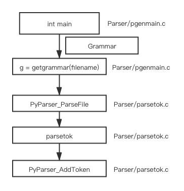
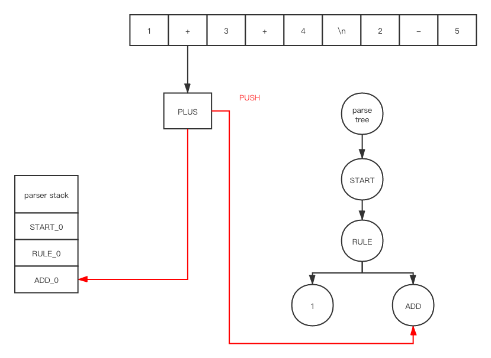

# compile

# 目录

* [相关位置文件](#相关位置文件)
* [pgen](#pgen)
  * [the dfa of `ExampleGrammar`](#the-dfa-of-ExampleGrammar)
  * [parse](#parse)
  * [make dfa](#make-dfa)

* [更多资料](#更多资料)

# 相关位置文件

* Python/pythonrun.c
* Parser/tokenizer.c
* Parser/tokenizer.h
* Parser/parsetok.c
* Include/grammar.h
* Parser/metagrammar.c
* Include/metagrammar.h
* Parser/pgen.c

# pgen

这是 `grammar` 结构体的定义


```bash
make regen-grammar
gcc -g -O0 -Wall  -L/usr/local/opt/llvm/lib   Parser/acceler.o Parser/grammar1.o Parser/listnode.o Parser/node.o Parser/parser.o Parser/bitset.o Parser/metagrammar.o Parser/firstsets.o Parser/grammar.o Parser/token.o Parser/pgen.o Objects/obmalloc.o Python/dynamic_annotations.o Python/mysnprintf.o Python/pyctype.o Parser/tokenizer_pgen.o Parser/printgrammar.o Parser/parsetok_pgen.o Parser/pgenmain.o -ldl   -framework CoreFoundation -o Parser/pgen
# Regenerate Include/graminit.h and Python/graminit.c
# from Grammar/Grammar using pgen
Parser/pgen ./Grammar/Grammar \
                ./Include/graminit.h.new \
                ./Python/graminit.c.new
Translating labels ...
python3 ./Tools/scripts/update_file.py ./Include/graminit.h ./Include/graminit.h.new
python3 ./Tools/scripts/update_file.py ./Python/graminit.c ./Python/graminit.c.new
```

在 `Parser/` 目录下, 上面的命令会编译 `Parser/pgenmain.o` 并生成一个叫 `Parser/pgen` 的程序, 这个程序的输入是语法文件, 并且把 `grammar` 结构体, `dfa` 表结构等上图所示的结构体作为输出(总共是两个c文件, `graminit.c` 和 `graminit.h`)


我们先来关注 `pgen` 这个程序

 `Parser/metagrammar.c` 和 `Include/metagrammar.h` 这两个内建的语法结构体会被用作 Python 语法文件的语法, 生成 `graminit.c` 和 `graminit.h` 之后, 就可以再次编译然后用 Python 的 Grammar 去进行解析 Python 的语法

`metagrammar` 的作用是解析 `EBNF` 格式的语法文件

`graminit` 的作用是解析 `Python` 源代码

他们都是通过同样的方式, 利用不用的 `Grammar` 自动生成的


其中 `Parser/metagrammar.c` 和 `Include/metagrammar.h` 语法如下

>```bash
>MSTART: (NEWLINE | RULE)* ENDMARKER
>RULE: NAME ':' RHS NEWLINE
>RHS: ALT ('|' ALT)*
>ALT: ITEM+
>ITEM: '[' RHS ']' | ATOM ['*' | '+']
>ATOM: NAME | STRING | '(' RHS ')'
>```

(上面的语法结构在源码中无法找到, 是 [python compiler from grammar to dfa](https://aoik.me/blog/posts/python-compiler-from-grammar-to-dfa) 中作者倒推出来的)

如果提供给内建的`pgen`相同的上述语法文件, 理论上会生成一模一样的 `Parser/metagrammar.c` 和 `Include/metagrammar.h`  文件, 这有点类似编译器自举的概念

我们通过写一行非常简单的语法规则来看 `pgen` 是如何工作的

```bash
% cat Grammar/ExampleGrammar 
START: (NEWLINE | RULE)* ENDMARKER
RULE: NUMBER (ADD NUMBER)*
ADD: '+' | '-'
```

我们可以利用默认的 `pgen` 程序来生成我们自己的 `ExampleGrammar`

```bash
make regen-grammar
Parser/pgen ./Grammar/ExampleGrammar \
                ./Include/examplegrammar.h \
                ./Parser/examplegrammar.c
```

为了让上述命令能正常工作, 需要进行一点手动的小改动, 最终的 [examplegrammar.c](https://github.com/zpoint/CPython-Internals/tree/master/Interpreter/compile/gen/examplegrammar.c) 

并且编译改动好的程序, 生成一个新的 `pgen2` 程序 [example_grammar.sh](https://github.com/zpoint/CPython-Internals/tree/master/Interpreter/compile/gen/example_grammar.sh)

```bash
sh example_grammar.sh
```

在得到 `Parser/pgen2` 之后, 我们能验证下我们的语法文件是否正常工作

```bash
% cat my_file.txt 
1 + 3 + 4
2 - 5
# 运行如下命令是会失败的, 我们的目的是看构建语法树和dfa的过程, 不是真的构建出一个能用的 dfa
# 如果你把 `Parser/parser.c` 中的宏注释掉, 并且留下或新建一行 '#define D(x) x' 然后重新运行上述的命令
# 你能看到我们的 DFA 状态是在 ACCEPT 的状态下的
# 表示我们的语法文件是正常工作的
Parser/pgen2 ./my_file.txt \
                ./Include/my_file.h \
                ./Parser/my_file.c
```

## the dfa of `ExampleGrammar`


这是根据 [examplegrammar.c](https://github.com/zpoint/CPython-Internals/tree/master/Interpreter/compile/gen/examplegrammar.c) 或者 [ExampleGrammar](https://github.com/zpoint/CPython-Internals/tree/master/Interpreter/compile/gen/ExampleGrammar) 用上述命令自动生成的 dfa

## parse

第一步是根据 [BuiltInGrammar](https://github.com/zpoint/CPython-Internals/tree/master/Interpreter/compile/gen/BuiltInGrammar) 来解析语法文件, 并且生成一颗语法树

 `Parser/pgenmain.c` 的调用栈如下



`parsetok` 会调用 `PyTokenizer_Get->tok_get` 来获得 tokens, 对于每个 token 都会调用`PyParser_AddToken` 方法

`tokens` 是在 `Parser/token.c` 和 `Include/token.h` 中预定义好的, 这两个文件也是通过 `Grammar/Tokens`  文件自动生成的, 自动生成的命令为 `make regen-token`

这是解析时使用的结构体


如果每一步都展开的话, 就会花费太多时间在细节上了, 我们就来用我们上面的 `ExampleGrammar` 来简单的解析下上面的 `my_file.txt` 文件看看

在 `push`之后


在 `shift`之后


在 `push`之后



在 `shift`之后


因为 `ADD_1` 是在 accept 状态下, 所以我们会调用 `POP`,  在 `POP `之后


在 `push` 和 `shift`之后


重复上述一系列操作之后


##  make dfa

`Parser/pgen.c`  中的下面的函数会把上述的语法树作为输入, 然后把 `grammar` 结构作为输出

```c
grammar *
pgen(node *n)
{
    nfagrammar *gr;
    grammar *g;

    gr = metacompile(n);
    g = maketables(gr);
    translatelabels(g);
    addfirstsets(g);
    freenfagrammar(gr);
    return g;
}
```

 `Parser/pgen.c` 中的注释如下

> ```c
> /*
> 输入是一个语法文件/结构, 格式是扩展的 BNF (* 表示重复, + 表示大于等于一次重复, [] 表示可选, | 表示或, () 表示分组) 输入的部分已经是一个语法树结构了
> 
> 每一个规则的右边部分都会被当成一个正则表达式, 并被转换成 NFA, 之后再转换成 DFA, 
> 之后再通过优化算法减小状态机的状态数量, 可以翻阅 See [Aho&Ullman 77] chapter 3,
> 或者相关的编译技术书籍查看相关资料 (这个技术通常是在 lexical
> analyzers 上用的多)
> 
> DFA 被 parser 以一种特殊的方式作为 parsing tables, 这样的处理方式可能在别的地方是看不到的
> 并且在 DFA 能使用之前, 所有的 non-terminals 的 FIRST 集合都会被提前计算出来
> */
> ```


# 更多资料

* [what-is-the-difference-between-an-abstract-syntax-tree-and-a-concrete-syntax-tree](https://stackoverflow.com/questions/1888854/what-is-the-difference-between-an-abstract-syntax-tree-and-a-concrete-syntax-tre)
* [What's the Difference Between BNF, EBNF, ABNF?](http://xahlee.info/parser/bnf_ebnf_abnf.html)
* [A Meta-Grammar for PEG Parsers](https://medium.com/@gvanrossum_83706/a-meta-grammar-for-peg-parsers-3d3d502ea332)
* [Python's compiler - from grammar to dfa](https://aoik.me/blog/posts/python-compiler-from-grammar-to-dfa)
* [the-origins-of-pgen](http://python-history.blogspot.com/2018/05/the-origins-of-pgen.html)

