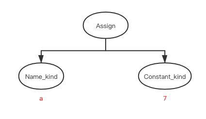

# AST TO byte code

# contents

* [related file](#related-file)
* [optimize](#optimize)
* [symtable](#symtable)
* [CodeObject](#CodeObject)
* [read more](#read-more)

# related file

* Python/compile.c

* Python/pythonrun.c

* Python/symtable.c

* Include/symtable.h

* Python/ast_opt.c

  

Let's generate the python code object from previous  [AST tree](https://github.com/zpoint/CPython-Internals/blob/master/Interpreter/compile2/compile.md)

The aforementioned `pythonrun` call stack


We will foucus on `PyAST_CompileObject` this time

```c
PyCodeObject *
PyAST_CompileObject(mod_ty mod, PyObject *filename, PyCompilerFlags *flags,
                   int optimize, PyArena *arena)
{
    struct compiler c;
    PyCodeObject *co = NULL;
    PyCompilerFlags local_flags;
    int merged;
		// ... omit ...

    if (!_PyAST_Optimize(mod, arena, c.c_optimize)) {
        goto finally;
    }

    c.c_st = PySymtable_BuildObject(mod, filename, c.c_future);
    if (c.c_st == NULL) {
        if (!PyErr_Occurred())
            PyErr_SetString(PyExc_SystemError, "no symtable");
        goto finally;
    }

    co = compiler_mod(&c, mod);

 finally:
    compiler_free(&c);
    assert(co || PyErr_Occurred());
    return co;
}
```

# optimize

`_PyAST_Optimize` will do some optimize such as constant folding

```c
static int
fold_binop(expr_ty node, PyArena *arena, int optimize)
{
    expr_ty lhs, rhs;
    lhs = node->v.BinOp.left;
    rhs = node->v.BinOp.right;
    if (lhs->kind != Constant_kind || rhs->kind != Constant_kind) {
        return 1;
    }

    PyObject *lv = lhs->v.Constant.value;
    PyObject *rv = rhs->v.Constant.value;
    PyObject *newval;

    switch (node->v.BinOp.op) {
    case Add:
        newval = PyNumber_Add(lv, rv);
        break;
    case Sub:
        newval = PyNumber_Subtract(lv, rv);
        break;
    case Mult:
        newval = safe_multiply(lv, rv);
        break;
    case Div:
        newval = PyNumber_TrueDivide(lv, rv);
        break;
    case FloorDiv:
        newval = PyNumber_FloorDivide(lv, rv);
        break;
    case Mod:
        newval = safe_mod(lv, rv);
        break;
    case Pow:
        newval = safe_power(lv, rv);
        break;
    case LShift:
        newval = safe_lshift(lv, rv);
        break;
    case RShift:
        newval = PyNumber_Rshift(lv, rv);
        break;
    case BitOr:
        newval = PyNumber_Or(lv, rv);
        break;
    case BitXor:
        newval = PyNumber_Xor(lv, rv);
        break;
    case BitAnd:
        newval = PyNumber_And(lv, rv);
        break;
    default: // Unknown operator
        return 1;
    }
    return make_const(node, newval, arena);
}
```

For example

```python3
a = 3 + 4
```

The AST is


After `fold_binop`, it becomes



The constant folding will also

* expand binary op(as above)

* expand your unary op(`not/is/isnot`)
* change you list literal to tuple
* fetch the constant sub index
* etc ...

# symtable

After `_PyAST_Optimize`, the `PySymtable_BuildObject` will traverse the AST and add stores the the function/class/name definition to a Python dict object


#CodeObject

`compiler_mod`  will traverse the AST, generate the appropriate byte code instruction and helper data, finally generate and return a`PyCodeObject`

```c
static int
compiler_visit_expr1(struct compiler *c, expr_ty e)
{
  		// ...
      case Constant_kind:
        ADDOP_LOAD_CONST(c, e->v.Constant.value);
        break;
  		// ...
}

static int
compiler_addop_load_const(struct compiler *c, PyObject *o)
{
  	// add the constant value to a dictionary object: c->u->u_consts, returns the index after converted to list(offset of arg list)
    Py_ssize_t arg = compiler_add_const(c, o);
    if (arg < 0)
        return 0;
  	// add the `LOAD_CONST arg` to the next instruction
    return compiler_addop_i(c, LOAD_CONST, arg);
}

// Below functions can be found in Python/compile.c
static int
compiler_addop_i(struct compiler *c, int opcode, Py_ssize_t oparg)
{
    struct instr *i;
    int off;

  	// ...
  
    off = compiler_next_instr(c, c->u->u_curblock);
    if (off < 0)
        return 0;
    i = &c->u->u_curblock->b_instr[off];
    i->i_opcode = opcode;
    i->i_oparg = Py_SAFE_DOWNCAST(oparg, Py_ssize_t, int);
    compiler_set_lineno(c, off);
    return 1;
}

static Py_ssize_t
compiler_add_const(struct compiler *c, PyObject *o)
{
    PyObject *key = merge_consts_recursive(c, o);
    if (key == NULL) {
        return -1;
    }

    Py_ssize_t arg = compiler_add_o(c, c->u->u_consts, key);
    Py_DECREF(key);
    return arg;
}

static Py_ssize_t
compiler_add_o(struct compiler *c, PyObject *dict, PyObject *o)
{
    PyObject *v;
    Py_ssize_t arg;

    v = PyDict_GetItemWithError(dict, o);
    if (!v) {
        if (PyErr_Occurred()) {
            return -1;
        }
        arg = PyDict_GET_SIZE(dict);
        v = PyLong_FromSsize_t(arg);
        if (!v) {
            return -1;
        }
        if (PyDict_SetItem(dict, o, v) < 0) {
            Py_DECREF(v);
            return -1;
        }
        Py_DECREF(v);
    }
    else
        arg = PyLong_AsLong(v);
    return arg;
}
```

The constants are stored in dict format, key represent the constant `PyObject`, value is the offset `{'a': 0}`

It will be converted to a list object in the order of value in `Python/compile.c->consts_dict_keys_inorder`

Finally, the `Python/compile.c->makecode` converts the compiled instrcutions and helper data to a newly create `PyCodeObject`

```shell
  1           0 LOAD_CONST               0 (7)
              2 STORE_NAME               0 (a)
              4 LOAD_CONST               1 (None)
              6 RETURN_VALUE
```


# read more

* [Python's compiler - from AST to code object](https://aoik.me/blog/posts/python-compiler-from-ast-to-code-object)

